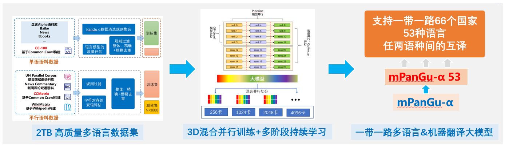
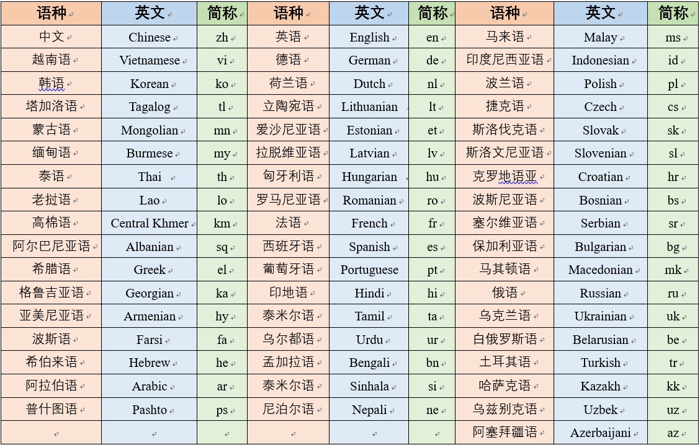
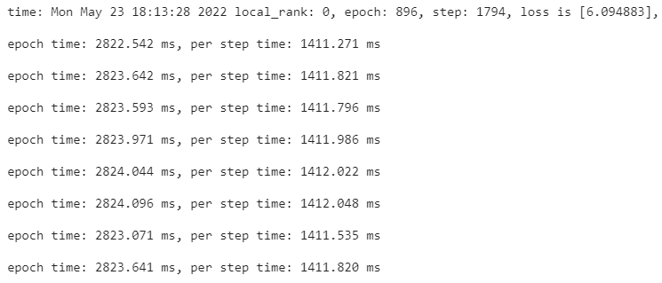
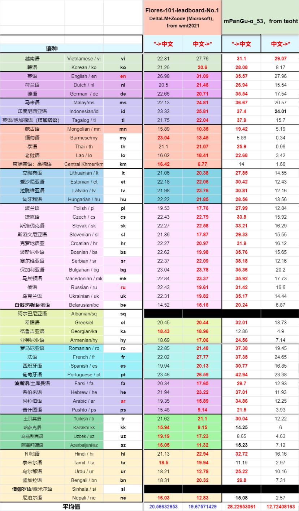
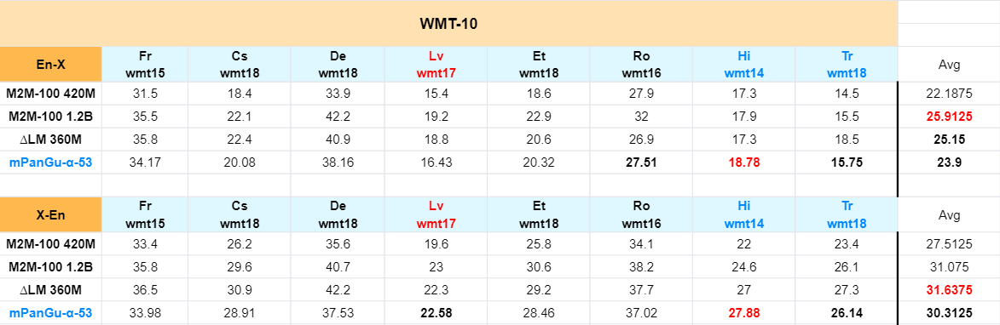

<!-- TOC -->
- [mPanGu-Alpha-53简介](#mPanGu-Alpha-53)
    - [实现流程](#实现流程)
    - [评测结果](#测评结果)
- [运行环境](#环境要求)
    - [GPU运行环境](#快速入门)
    - [NPU运行环境](#NPU运行环境)
    - [靶场环境运行](#靶场环境运行)
    - [AiSynergy协同运行](#AiSynergy协同运行)
- [快速入门（1分钟在OpenI协作平台实现训练）](#快速入门)
- [测评结果对比](#测评结果)
- [数据开源](#数据开源)
- [交流通道](#交流)
- [许可证](#许可证)
<!-- /TOC -->

# mPanGu-Alpha-53

mPanGu-α-53 来源于鹏程·PanGu-α，基于一带一路多语言翻译场景应用，基于“鹏城云脑2”128卡在自行构建的2TB高质量多语言单双语语料集上进行预训练+混合语料训练，得到2.6B预训练多语言模型+2.6B一带一路53种语言机器翻译模型，支持多语言翻译任务的“迁移学习”，支持在NPU/GPU上基于MindSpore分布式训练（最少8卡）、推理（全精度/FP16，1卡），单模型支持53种语言任意两种语言间的互译。在WMT2021多语言任务赛道，在FLORES-101 devtest数据集，对比任务榜单No.1已覆盖的50种语言“中<->外”100个翻译方向平均BLEU值提升0.354


目前GPU/NPU两个版本是因为MindSpore使用版本不同，‘鹏城云脑2’NPU目前支持的MindSpore主流版本是1.3, GPU平台使用MS1.6版本的适配性更好
### 实现流程
<br/>


| 阶段      | 学习率   | warmup  |beta1|beta2|batchsize| steps  |等效token| 
| :------- | :---- | :-------- |:---- |:---- |:---- |:-------|:---- |
| 预训练    | 1e-4~1e-6 |2000|  0.9 | 0.94 | 512 | 915000 | 480 B |
| 混合增量学习  | 5e-5~5e-7 |2000 |  0.9 | 0.94 | 512 | 765000 | 400 B |

#### 支持语种
<br/>

## 环境要求
### GPU运行环境
- mPanGu_alpha_GPU， 建议cuda版本在11.1-11.3，其他版本未测试过可能存在兼容性问题
```bash
MindSpore 1.6.1
```
- docker镜像
```bash
docker pull hengtao2/mindspore:gpu_ms_1.6.1
```
或者使用MindSpore官方在[Docker Hub](https://hub.docker.com/r/mindspore)上托管的Docker镜像。
### NPU运行环境
- mPanGu_alpha_NPU
```bash
MindSpore 1.3
```
基于“鹏城云脑2”+ModelArts，运行在C76版本环境（同OpenI启智协作平台NPU训练任务环境）
### 靶场环境运行
AI靶场是基于方滨兴院士提出的“数据不动程序动、数据可用不可见、分享价值不分享数据、保留所有权释放使用权”隐私保护新理念， 在鹏城实验室构建的数据要素流通交易新型基础设施平台。通过调试环境与运行环境分离体系架构以及仿真数据生成、隐私保护前提下的调试等创新技术，确保数据所有权和使用权分离，可以让更多的数据提供方敢于将其数据安全托管，让更多的数据使用方能够充分挖掘真实场景真实数据。

[基于靶场的mPanGu,单机、多卡+单方、多方数据协同训练场景](https://git.openi.org.cn/PCL-Platform.Intelligence/AISynergy/src/branch/V2.0.0/examples/mPanGu)
### AiSynergy协同运行
[AiSynergy云际协同训练](https://git.openi.org.cn/PCL-Platform.Intelligence/AISynergy/src/branch/master/examples/panguAlpha_mindspore/mPanGu_alpha_mindspore)

### 模型文件下载
| 模型                        | 大小     | 来源                                                                                               | md5                              |
|:--------------------------|:-------|:-------------------------------------------------------------------------------------------------|:---------------------------------|
| 鹏程·mPanGu-α-53 FP32       | 11.8 G | [2.6B 多语言预训练](https://git.openi.org.cn/attachments/74f02d29-1ce7-4f12-89a5-50e7ee3cab0d?type=0)  | ed76089e93d097e1991b1575f57af12e |
| 鹏程·mPanGu-α-53 FP16       | 6.56 G | [2.6B 多语言预训练](https://git.openi.org.cn/attachments/42fbe1b7-8d61-4126-a74b-dd754fdc47e1?type=0)  | 3f2ecdb3860b1b28d9022c6be5dd4f90 |
| 鹏程·mPanGu-α-53 FP32       | 10.9 G | [2.6B 多语言翻译](https://git.openi.org.cn/attachments/584e1945-a01c-4f08-a9b6-9bd30f0e21be?type=0)   | f5538e265017c8ed78a3121883a80b04 |
| 鹏程·mPanGu-α-53 FP16       | 5.62 G | [2.6B 多语言翻译](https://git.openi.org.cn/attachments/3fa0d3cb-bda6-4bd1-8c24-bab2600518c0?type=0)   | 4e778059c6c519ec29d64159f8a2dd1a |
| 鹏程·mPanGu-α-53_mn-lo FP32 | 12.0 G | [2.6B mn_lo微调](https://git.openi.org.cn/attachments/d9f97d25-945d-4709-83d6-81850f06cd3c?type=0)   | -                                |
| 鹏程·mPanGu-α-53_mn-lo FP16       | 6.0 G  | [2.6B mn_lo微调](https://git.openi.org.cn/attachments/7a39dcba-c584-46b2-9de5-dc68fd2d90bb?type=0) | -                                |

### 数据开源
我们的数据基于Ai靶场环境进行开源开放
| 数据集      |   数据使用权限申请     | 描述  | 数据名称      |
| --------- | ------------- | ----------- | ------- |
| [一带一路多语言1T数据集](./docs/B&R-M-1T_dataset.md) | 如有使用数据集的需求，请邮件反馈至 taoht@pcl.ac.cn| 每个文件为该语种单或双语抽样语料，目前包含52种语种数据，语料来自于PanGu-Alpha中文语料、CC-100、CCMatrix、UN Parallel Corpus、WMT等经过规则过滤、全局精确和模糊去重、双语字符对齐过滤等清洗流程得到   | B&R-M-1T  |

```bash
数据：邮件提交使用者信息，项目标注数据来源，完全开源开放，请联系：taoht@pcl.ac.cn
模型：mPanGu-α、 mPanGu-α-53全开源（FP32、FP16）
代码： GPU/NPU双平台支持，训练、推理全开源，支持AIsynergy跨集群协同训练
运行环境：OpenI启智协作平台（GPU/NPU）
技术交流：鹏程盘古α技术交流群、 OpenI启智社区
```
#### 数据处理
[数据处理流程](./datasets/README.md)

## 快速入门
### [1分钟在OpenI AI协作平台实现训练](https://git.openi.org.cn/PCL-Platform.Intelligence/mPanGu-Alpha-53/modelarts/train-job/42568/create_version?version_name=V0020)
- 参考本项目->[云脑（标题栏）](https://git.openi.org.cn/PCL-Platform.Intelligence/mPanGu-Alpha-53/debugjob?debugListType=all) ->[训练任务](https://git.openi.org.cn/PCL-Platform.Intelligence/mPanGu-Alpha-53/modelarts/train-job) ->[taoht-npu-train-example](https://git.openi.org.cn/PCL-Platform.Intelligence/mPanGu-Alpha-53/modelarts/train-job/42568) ->[修改](https://git.openi.org.cn/PCL-Platform.Intelligence/mPanGu-Alpha-53/modelarts/train-job/42568/create_version?version_name=V0019) ->新建任务
- 详细步骤可查看[npu分支](https://git.openi.org.cn/PCL-Platform.Intelligence/mPanGu-Alpha-53/src/branch/npu)
- master分支启动文件(加上目录结构): mPanGu_alpha_NPU/train.py

<br/>

### GPU推理
./mPanGu_alpha_GPU/
```bash
1、脚本启动
bash scripts/run_distribute_inference.sh #启动脚本
     8 #使用卡数
     hostfile_8gpus #hostfile文件
     2.6B #模型规模
     '8,9,10,11,12,13,14,15' #使用的卡id

bash scripts/run_distribute_inference.sh 8 /tmp/hostfile_8gpus 2.6B '8,9,10,11,12,13,14,15'
2、命令行启动
# 以单卡推理为例
mpirun --allow-run-as-root -x PATH -x LD_LIBRARY_PATH -x PYTHONPATH -x NCCL_DEBUG -x GLOG_v \
       -n 1 \#使用卡数
       --hostfile hostfile_1gpus \
       --output-filename log_output \
       --merge-stderr-to-stdout \
       python -s /path/to/predict.py \
              --mode 2.6B \
              --run_type predict \
              --distribute false \
              --op_level_model_parallel_num 1 \#同使用卡数保持一致
              --load_ckpt_path  /path/to/ckpt_path/ \
              --load_ckpt_name  /ckpt_name \
              --param_init_type  "fp16" #"fp16" or "fp32"
```
### NPU推理
ModelArts启动任务，启动文件predict.py
```bash
运行参数配置：
    device_num=1
    op_level_model_parallel_num=1
    run_type=predict
资源选择：
Ascend: 1 * Ascend-910(32GB) | ARM: 24 核 256GB
```

### GPU训练

运行如下命令开始训练，2.6B 单机16卡GPU运行
```bash
bash scripts/run_distribute_train_gpu.sh 
     16 #使用卡数
     hostfile #hostfile文件
     dataset/test/ #训练集
     8 #batchsize
     2.6B #模型规模

bash scripts/run_distribute_train_gpu.sh 16 /tmp/hostfile dataset/test/ 8 2.6B
```

### NPU训练
ModelArts启动任务（以8卡为例），启动文件train.py
```bash
模型相关配置位于./src/utils.py和./src/pangu_alpha_config.py
运行参数配置：
    data_url=数据集目录
    device_num=8
    op_level_model_parallel_num=1（1或8都可以）
    per_batch_size=8
    mode=2.6B (指模型大小350M/2.6B/13B/200B...)
    full_batch=1
    run_type=train
资源选择：
Ascend: 8 * Ascend-910(32GB) | ARM: 192 核 2048GB
```
### 测评结果
- 在官方devtest数据集“中<->外”翻译方向，对比WMT2021 “多语言赛道”No.1得分的结果

<br/>

- 对比Facebook M2M-100、Microsoft delta LM等多语言模型论文中在“英<->外”翻译方向的结果对比(未进行特定语种方向增强，特定语种方向迁移学习后会有进一步提升)

<br/>
### 迁移学习研究
- 实验是在zh<->mn、zh<->lo语方向进行迁移学习微调，大约64卡NPU训练几小时，初步对比结果如下：
- test集来源于人工审核后的每个语种方向包含5大领域约3000条标准测试集（暂未开放）
- 该测评结果使用2.6B 鹏程·mPanGu-α-53_mn-lo单模型，评测数据和结果均未经过前后处理，直接对比一线商用翻译系统

| 模型/系统 (BLEU)         |lo2zh | zh2lo  | mn2zh   | zh2mn  |
|:---------------------| :---- | :-------------| :--------------- |:-------------------- |
| 国内商用系统 1             | 40.4|25.9 | 37.48|41.32 |
| 国内商用系统 2             | 36.74 | 15.5| 33.52| 33.11|
| google               | 35.08 | 23.64| 30.78| 34.15|
| microsoft            | 28.63 | 20.35| 23.39|19.18 |
| 鹏程·mPanGu-α-53_mn-lo | 38.16 | 26.76 |34.65 | 28.17|


#### 交流通道
- 提问：https://git.openi.org.cn/PCL-Platform.Intelligence/mPanGu-Alpha-53/issues
- 邮箱：taoht@pcl.ac.cn
- 微信群： 添加微信(备注交流群)加入技术交流群
<br/>

### 项目信息
鹏城实验室-智能部-开源所-基础技术研究室

### 许可证

[Apache License 2.0](https://git.openi.org.cn/PCL-Platform.Intelligence/mPanGu-Alpha-53)

